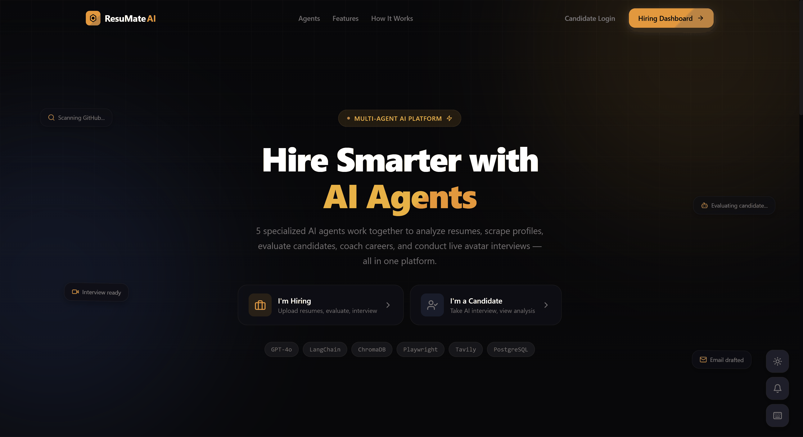
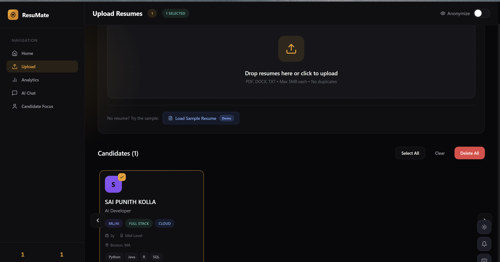
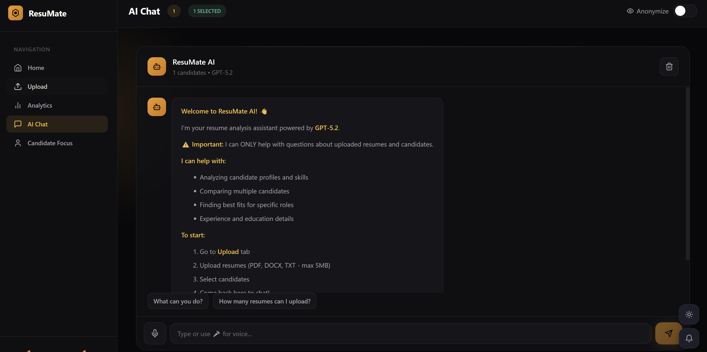
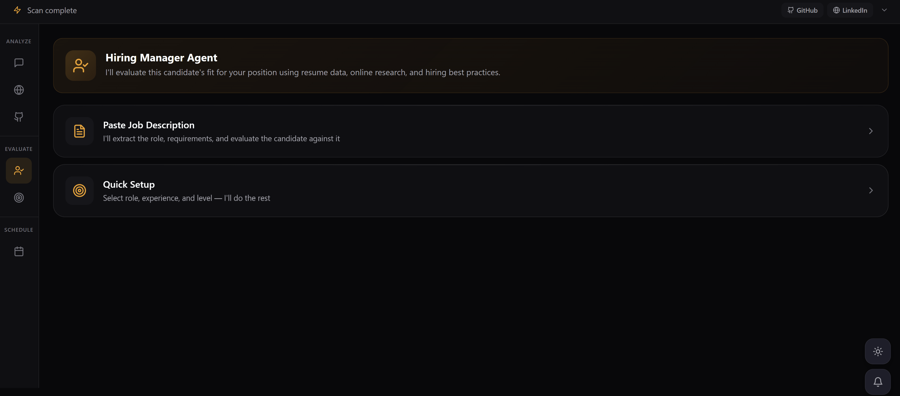
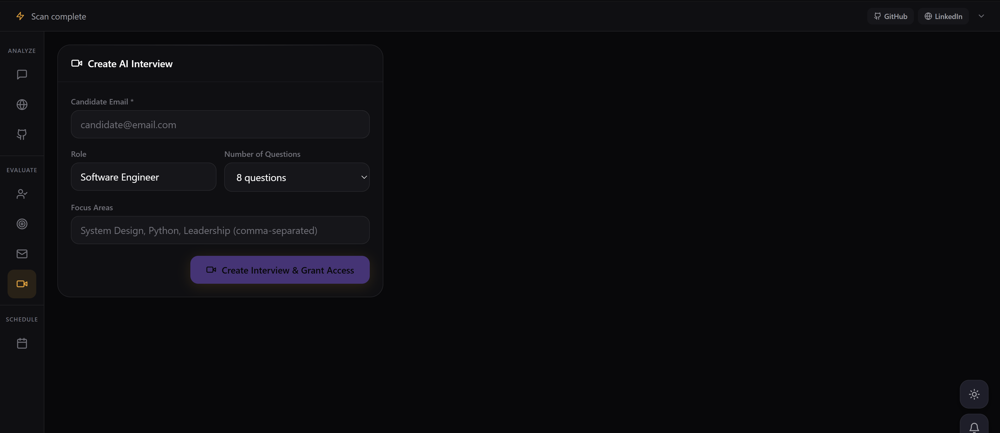
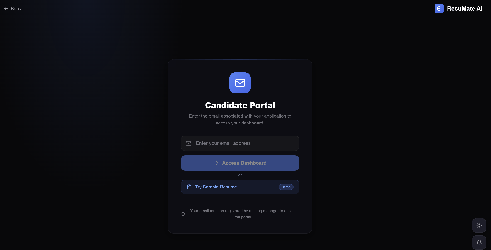
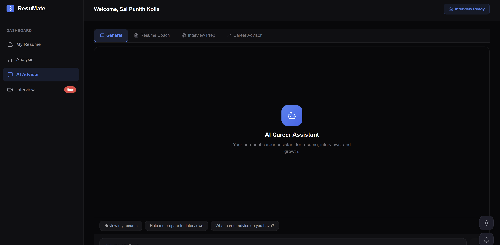

<p align="center">
  
  
  
  
  
  
  
</p>

# ResuMate AI

**A full-stack multi-agent AI hiring platform** with real-time avatar interviews, career coaching, and intelligent candidate evaluation.

ResuMate AI isn't a wrapper around ChatGPT — it's a production-grade system where **5 specialized AI agents** orchestrate the entire hiring pipeline, from resume parsing to live video interviews with a lip-synced AI avatar.

---

## Demo

> **Live Demo:** [resumate-2vad.onrender.com](https://resumate-2vad.onrender.com)
>
> *Free-tier hosting — first load may take ~30s to wake up.*

---

## Platform Preview

### Landing Page & Agent Showcase
<p align="center">
  
</p>

---

### Hiring Manager Dashboard

#### Upload & Analytics
<p align="center">
  
</p>

Upload resumes, view analytics, and let AI rank candidates automatically.

#### AI Chat & Candidate Focus
<p align="center">
  
</p>

Multi-candidate AI chat, deep-dive candidate focus with GitHub scanning and resume intelligence.

#### Candidate Evaluation
<p align="center">
  
</p>

AI-powered evaluation reports with role fit scoring, strengths, and growth areas.

#### Interview Setup & Scheduling
<p align="center">
  
</p>

Create AI interviews, draft professional emails, and schedule meetings — all from one place.

---

### Candidate Portal

#### Login, Dashboard & Analytics
<p align="center">
  
</p>

Email-based authentication, resume analysis, and personalized analytics.

#### AI Advisor & Live Interview
<p align="center">
  
</p>

AI career advisor with resume coaching, interview prep — then step into a live video interview with an AI avatar interviewer featuring face tracking and proctoring.

---

## Architecture

### System Overview

```
                         ┌─────────────────────────────────┐
                         │        ResuMate AI Platform       │
                         └────────────────┬──────────────────┘
                                          │
                    ┌─────────────────────┼─────────────────────┐
                    │                     │                     │
            ┌───────▼───────┐    ┌───────▼────────┐   ┌───────▼───────┐
            │    Hiring     │    │   Candidate    │   │   Interview   │
            │    Manager    │    │    Portal      │   │    System     │
            │    Portal     │    │               │   │               │
            └───────┬───────┘    └───────┬────────┘   └───────┬───────┘
                    │                    │                     │
                    ▼                    ▼                     ▼
       ┌─────────────────────────────────────────────────────────────┐
       │                    FastAPI Backend                          │
       │                  (25+ REST Endpoints)                      │
       └─────────────────────────┬───────────────────────────────────┘
                                 │
       ┌────────────┬────────────┼────────────┬────────────┐
       │            │            │            │            │
  ┌────▼────┐ ┌────▼────┐ ┌────▼─────┐ ┌───▼─────┐ ┌───▼──────┐
  │  Data   │ │   HR    │ │Technical │ │Research │ │ Advisor  │
  │  Agent  │ │  Agent  │ │  Agent   │ │  Agent  │ │  Agent   │
  └─────────┘ └─────────┘ └────┬─────┘ └─────────┘ └────┬─────┘
                               │                         │
                         ┌─────┴─────┐            ┌──────┼──────┐
                         │           │            │      │      │
                    ┌────▼───┐ ┌────▼────┐  ┌────▼──┐ ┌▼────┐ ┌▼──────┐
                    │Interview│ │Scoring  │  │Resume │ │Int. │ │Career │
                    │ Agent  │ │ Agent   │  │Coach  │ │Prep │ │Advisor│
                    └────────┘ └─────────┘  └───────┘ └─────┘ └───────┘
```

### Agent Framework

Each agent follows the **Plan → Execute → Reflect → Output** pipeline:

```
┌──────────┐     ┌──────────┐     ┌──────────┐     ┌──────────┐
│   PLAN   │ ──▶ │ EXECUTE  │ ──▶ │ REFLECT  │ ──▶ │  OUTPUT  │
│          │     │          │     │          │     │          │
│ Analyze  │     │ Run      │     │ Quality  │     │ Format   │
│ task     │     │ tools    │     │ check    │     │ results  │
└──────────┘     └──────────┘     └──────────┘     └──────────┘
```

### Interview System Architecture

```
┌──────────────────┐              ┌──────────────────────┐
│                  │   LiveKit    │                      │
│  Candidate       │   WebRTC    │   Interview Agent     │
│  Browser         │◄──────────►│   (Python Process)    │
│                  │    Room     │                      │
│  ┌────────────┐  │              │  ┌────────────────┐  │
│  │ Camera     │  │              │  │ OpenAI         │  │
│  │ + Mic      │  │              │  │ Realtime API   │  │
│  ├────────────┤  │              │  │ (Voice-to-     │  │
│  │ Face       │  │              │  │  Voice)        │  │
│  │ Tracking   │  │              │  ├────────────────┤  │
│  ├────────────┤  │              │  │ Simli Avatar   │  │
│  │ Tab        │  │              │  │ (Lip-synced    │  │
│  │ Monitor    │  │              │  │  Face)         │  │
│  └────────────┘  │              │  └────────────────┘  │
└──────────────────┘              └──────────────────────┘
```

---

## Features

### Hiring Manager Portal
- **Resume Upload & RAG** — PDF/DOCX parsing, ChromaDB vector storage, contextual AI chat
- **Automated Candidate Ranking** — AI compares all candidates and recommends who to interview first
- **Resume Intelligence** — Gap analysis, skill verification targets, red flag detection
- **Scanner Agent** — Extracts embedded links, scrapes GitHub profiles, searches LinkedIn via Tavily
- **AI Chat** — Multi-candidate comparison, voice input/output, anonymization mode
- **Hiring Agent** — Role-specific evaluation with JD matching, generates fit reports
- **Credibility Analysis** — Cross-references resume claims against interview performance
- **Email Composer** — AI-drafted emails (interest, interview, offer, pass, follow-up)
- **Interview Creator** — Configure role, level, questions, focus areas → grants candidate access
- **PDF Report Export** — Branded downloadable assessment reports

### Candidate Portal
- **Resume Upload** — Single-resume-per-candidate with replace flow
- **AI Advisor (3 Sub-Agents)**
  - **Resume Coach** — Identifies gaps, suggests improvements, ATS optimization
  - **Interview Prep** — Practice questions, STAR method coaching, role-specific prep
  - **Career Advisor** — Strengths analysis, career paths, skill recommendations
- **Live AI Interview** — Real-time video interview with AI avatar
- **Interview Report** — Scores, eye contact %, proctoring summary, credibility analysis

### Interview System
- **LiveKit Cloud** — WebRTC room infrastructure for real-time audio/video
- **Simli Avatar** — Lip-synced AI avatar as the interviewer's face
- **OpenAI Realtime API** — Voice-to-voice conversation (no TTS/STT latency)
- **Smart Questions** — Interview questions informed by resume gap analysis
- **Proctoring** — Face detection, eye tracking, tab monitoring, fullscreen enforcement
- **3-Violation Auto-Termination** — Tab switch, window blur, or fullscreen exit = violation

### Analytics
- **Candidate Analytics** — Skills distribution, experience comparison, role & level breakdown
- **Interview Analytics** — Completion rates, score distribution, high/low performers, recent interviews

### UI/UX
- **Glassmorphism Design** — Backdrop blur, gradient borders, subtle animations
- **Dark + Light Theme** — Full support on both portals (amber accent hiring, blue accent candidate)
- **DM Sans Typography** — Consistent font system across all pages
- **Responsive** — Mobile-friendly sidebar collapse

---

## Tech Stack

| Layer | Technology |
|-------|-----------|
| **Frontend** | React 18, Vite, React Router, Lucide Icons |
| **Backend** | FastAPI, Python 3.13, Uvicorn |
| **AI/LLM** | OpenAI GPT-4o, text-embedding-3-small, Whisper, TTS, Realtime API |
| **Vector DB** | ChromaDB with LangChain integration |
| **Interview** | LiveKit Cloud (WebRTC), Simli (avatar), OpenAI Realtime (voice) |
| **Search** | Tavily API for web search and fact-checking |
| **Deployment** | Render (API + frontend), Fly.io (interview agent) |
| **Styling** | Custom CSS with design tokens, CSS variables, glassmorphism |

---

## 5 Specialized Agents

| Agent | Role | Tools |
|-------|------|-------|
| **Data Agent** | Resume parsing, profile scraping, data enrichment | PyPDF2, Playwright, GitHub API, Tavily |
| **HR Agent** | Candidate evaluation, email drafting, hiring recommendations | GPT-4o, salary research |
| **Technical Agent** | Interview orchestration, credibility analysis, smart questions | LiveKit, Simli, OpenAI Realtime |
| ↳ Interview Agent | Conducts live avatar interview with resume-informed probing | Voice AI, Simli lip-sync |
| ↳ Scoring Agent | Per-question scoring, credibility cross-referencing | GPT-4o evaluation |
| **Research Agent** | Web search, fact-checking, citation | Tavily Search API |
| **Advisor Agent** | Candidate career coaching (3 modes) | GPT-4o, resume context |

---

## Setup

### Prerequisites

- Python 3.10+
- Node.js 18+
- OpenAI API key
- Tavily API key (for web search)
- LiveKit Cloud account (for interviews)
- Simli account (for avatar)

### Environment Variables

Create `backend/.env`:

```env
OPENAI_API_KEY=sk-...
TAVILY_API_KEY=tvly-...
GITHUB_TOKEN=ghp_...
DATABASE_URL=sqlite+aiosqlite:///./resumate.db
CORS_ORIGINS=http://localhost:3001

# LiveKit (for interview system)
LIVEKIT_URL=wss://your-project.livekit.cloud
LIVEKIT_API_KEY=your-key
LIVEKIT_API_SECRET=your-secret

# Simli (for AI avatar)
SIMLI_API_KEY=your-simli-key
SIMLI_FACE_ID=your-face-id
```

### Installation

```bash
# Backend
cd backend
python -m venv venv
venv\Scripts\activate        # Windows
# source venv/bin/activate   # Mac/Linux
pip install -r requirements.txt

# Frontend
cd frontend
npm install
```

### Running

```bash
# Terminal 1: Backend API
cd backend
uvicorn main:app --reload --port 8000

# Terminal 2: Interview Agent (LiveKit + Simli)
cd backend
python interview_agent.py dev

# Terminal 3: Frontend
cd frontend
npm run dev
```

Open **http://localhost:3001**

---

## Project Structure

```
resumate-pro/
├── backend/
│   ├── main.py                      # FastAPI app + router registration
│   ├── interview_agent.py           # LiveKit interview agent (separate process)
│   ├── Dockerfile.agent             # Docker config for interview agent
│   ├── fly.toml                     # Fly.io deployment config
│   ├── app/
│   │   ├── api/
│   │   │   ├── chat.py              # Chat, interview, ranking, PDF export endpoints
│   │   │   ├── candidates.py        # Upload, delete, CRUD endpoints
│   │   │   ├── livekit_routes.py    # Room creation, token generation
│   │   │   └── advisor_agent.py     # Candidate-facing advisor (3 sub-agents)
│   │   ├── agents/
│   │   │   ├── base_agent.py        # Plan → Execute → Reflect → Output framework
│   │   │   ├── orchestrator.py      # Agent routing and coordination
│   │   │   ├── data_agent.py        # Resume parsing + profile scraping
│   │   │   ├── hr_agent.py          # Evaluation + email drafting
│   │   │   ├── technical_agent.py   # Interview questions, scoring, credibility
│   │   │   └── research_agent.py    # Web search + fact checking
│   │   ├── services/
│   │   │   ├── resume_rag.py        # ChromaDB RAG + resume analysis
│   │   │   ├── db_service.py        # PostgreSQL/SQLite CRUD operations
│   │   │   └── auth.py              # Token authentication
│   │   ├── models/
│   │   │   └── candidate.py         # Candidate, Interview, Evaluation ORM models
│   │   └── core/
│   │       ├── config.py            # Settings + environment variables
│   │       └── database.py          # Async database initialization
│   └── uploads/                     # Temporary file storage
│
├── frontend/
│   ├── src/
│   │   ├── main.jsx                 # App entry + CSS imports
│   │   ├── App.jsx                  # Route definitions
│   │   ├── components/
│   │   │   ├── Landing.jsx          # Landing page with agent showcase
│   │   │   ├── Dashboard.jsx        # Hiring manager dashboard
│   │   │   ├── CandidateFocus.jsx   # Deep-dive tools per candidate
│   │   │   ├── CandidateLogin.jsx   # Email-based candidate authentication
│   │   │   ├── CandidateDashboard.jsx # Candidate portal with advisor chat
│   │   │   ├── InterviewRoom.jsx    # LiveKit + Simli interview room
│   │   │   └── focus/
│   │   │       ├── ResumeIntelPanel.jsx  # Resume intelligence analysis
│   │   │       ├── InterviewCreator.jsx  # Interview configuration
│   │   │       ├── HiringAgentPanel.jsx  # AI evaluation
│   │   │       ├── EmailComposer.jsx     # Email drafting
│   │   │       └── ...                   # Chat, GitHub, Scanner, Schedule
│   │   ├── context/
│   │   │   └── AppContext.jsx       # Global state management
│   │   └── styles/                  # 8 CSS files, 3600+ lines
│   └── vite.config.js              # Dev server + API proxy
│
├── screenshots/                     # App screenshots
│   └── gifs/                        # Animated GIF previews
└── render.yaml                      # Render deployment blueprint
```

---

## API Endpoints

### Chat & AI
| Method | Endpoint | Description |
|--------|----------|-------------|
| POST | `/api/chat/send` | Send message to AI chat |
| POST | `/api/chat/focus` | Single-candidate deep chat |
| POST | `/api/chat/automate-ranking` | AI-powered candidate ranking |
| POST | `/api/chat/resume-intelligence` | Resume gap analysis |
| POST | `/api/chat/credibility-analysis` | Resume vs interview cross-reference |
| POST | `/api/chat/smart-questions` | Resume-informed interview questions |
| GET | `/api/chat/export-report/{email}` | Download branded PDF report |

### Interview
| Method | Endpoint | Description |
|--------|----------|-------------|
| POST | `/api/chat/create-interview` | Create interview for candidate |
| POST | `/api/chat/generate-interview-questions` | Generate role-specific questions |
| POST | `/api/chat/score-answer` | Score an interview answer |
| POST | `/api/chat/interview-report` | Generate comprehensive report |
| POST | `/api/chat/save-interview-result` | Save interview results |
| GET | `/api/chat/get-all-interview-results` | All completed interviews |

### Candidates
| Method | Endpoint | Description |
|--------|----------|-------------|
| POST | `/api/candidates/upload` | Upload and analyze resume |
| GET | `/api/candidates` | Get all candidates |
| DELETE | `/api/candidates/{id}` | Delete candidate |

### LiveKit
| Method | Endpoint | Description |
|--------|----------|-------------|
| POST | `/api/livekit/create-room` | Create interview room |
| GET | `/api/livekit/interview-room-config/{name}` | Get room config |

---

## How It Works

### Hiring Manager Flow
```
Upload Resumes → Data Agent parses + enriches
     ↓
Automate → AI ranks candidates, recommends interview order
     ↓
Resume Intel → Gap analysis, verification targets, red flags
     ↓
Hiring Agent → Evaluates against job description
     ↓
Create Interview → Smart questions from resume analysis
     ↓
Email Candidate → AI-drafted invitation
     ↓
Post-Interview → Credibility analysis + PDF export
```

### Candidate Flow
```
Login (email verification) → access granted by hiring manager
     ↓
Upload Resume → AI analyzes and stores context
     ↓
AI Advisor → Resume Coach | Interview Prep | Career Advisor
     ↓
Join Interview → LiveKit room connects
     ↓
AI Avatar (Simli) interviews with resume-informed questions
     ↓
Report → scores, eye contact, credibility analysis, PDF export
```

---

## License

MIT

---

<p align="center">
  Built by <strong>Sai Punith Kolla</strong>
</p>
