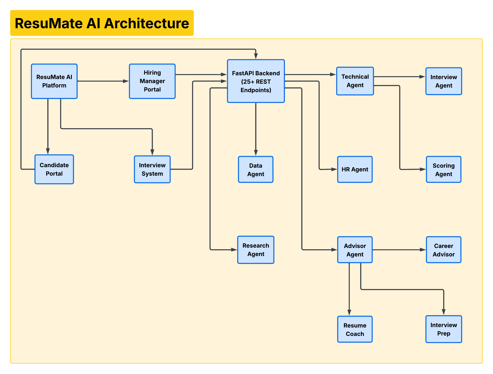
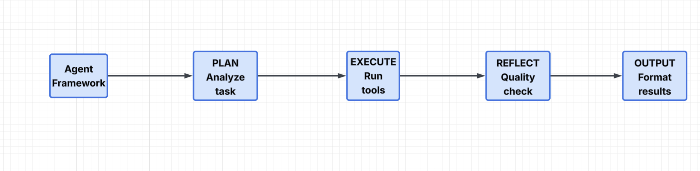

<p align="center">
  
  
  
  
  
  
  
</p>

# ResuMate AI

**A full-stack multi-agent AI hiring platform** with real-time avatar interviews, career coaching, and intelligent candidate evaluation.

ResuMate AI isn't a wrapper around ChatGPT — it's a production-grade system where **5 specialized AI agents** orchestrate the entire hiring pipeline, from resume parsing to live video interviews with a lip-synced AI avatar.

---

## Demo

> **Live Demo:** [resumate-2vad.onrender.com](https://resumate-2vad.onrender.com)
>
> *Free-tier hosting — first load may take ~30s to wake up.*

---

## Platform Preview

### Landing Page & Agent Showcase
<p align="center">
  
</p>

---

### Hiring Manager Dashboard

#### Upload & Analytics
<p align="center">
  
</p>

Upload resumes, view analytics, and let AI rank candidates automatically.

#### AI Chat & Candidate Focus
<p align="center">
  
</p>

Multi-candidate AI chat, deep-dive candidate focus with GitHub scanning and resume intelligence.

#### Candidate Evaluation
<p align="center">
  
</p>

AI-powered evaluation reports with role fit scoring, strengths, and growth areas.

#### Interview Setup & Scheduling
<p align="center">
  
</p>

Create AI interviews, draft professional emails, and schedule meetings — all from one place.

---

### Candidate Portal

#### Login, Dashboard & Analytics
<p align="center">
  
</p>

Email-based authentication, resume analysis, and personalized analytics.

#### AI Advisor & Live Interview
<p align="center">
  
</p>

AI career advisor with resume coaching, interview prep — then step into a live video interview with an AI avatar interviewer featuring face tracking and proctoring.

---

## Architecture

### System Overview
<p align="center">
  
</p>

### Agent Framework
<p align="center">
  
</p>

---

## Features

### Hiring Manager Portal
- **Resume Upload & RAG** — PDF/DOCX parsing, ChromaDB vector storage, contextual AI chat
- **Automated Candidate Ranking** — AI compares all candidates and recommends who to interview first
- **Resume Intelligence** — Gap analysis, skill verification targets, red flag detection
- **Scanner Agent** — Extracts embedded links, scrapes GitHub profiles, searches LinkedIn via Tavily
- **AI Chat** — Multi-candidate comparison, voice input/output, anonymization mode
- **Hiring Agent** — Role-specific evaluation with JD matching, generates fit reports
- **Credibility Analysis** — Cross-references resume claims against interview performance
- **Email Composer** — AI-drafted emails (interest, interview, offer, pass, follow-up)
- **Interview Creator** — Configure role, level, questions, focus areas → grants candidate access
- **PDF Report Export** — Branded downloadable assessment reports

### Candidate Portal
- **Resume Upload** — Single-resume-per-candidate with replace flow
- **AI Advisor (3 Sub-Agents)**
  - **Resume Coach** — Identifies gaps, suggests improvements, ATS optimization
  - **Interview Prep** — Practice questions, STAR method coaching, role-specific prep
  - **Career Advisor** — Strengths analysis, career paths, skill recommendations
- **Live AI Interview** — Real-time video interview with AI avatar
- **Interview Report** — Scores, eye contact %, proctoring summary, credibility analysis

### Interview System
- **LiveKit Cloud** — WebRTC room infrastructure for real-time audio/video
- **Simli Avatar** — Lip-synced AI avatar as the interviewer's face
- **OpenAI Realtime API** — Voice-to-voice conversation (no TTS/STT latency)
- **Smart Questions** — Interview questions informed by resume gap analysis
- **Proctoring** — Face detection, eye tracking, tab monitoring, fullscreen enforcement
- **3-Violation Auto-Termination** — Tab switch, window blur, or fullscreen exit = violation

### Analytics
- **Candidate Analytics** — Skills distribution, experience comparison, role & level breakdown
- **Interview Analytics** — Completion rates, score distribution, high/low performers, recent interviews

### UI/UX
- **Glassmorphism Design** — Backdrop blur, gradient borders, subtle animations
- **Dark + Light Theme** — Full support on both portals (amber accent hiring, blue accent candidate)
- **DM Sans Typography** — Consistent font system across all pages
- **Responsive** — Mobile-friendly sidebar collapse

---

## Tech Stack

| Layer | Technology |
|-------|-----------|
| **Frontend** | React 18, Vite, React Router, Lucide Icons |
| **Backend** | FastAPI, Python 3.13, Uvicorn |
| **AI/LLM** | OpenAI GPT-4o, text-embedding-3-small, Whisper, TTS, Realtime API |
| **Vector DB** | ChromaDB with LangChain integration |
| **Interview** | LiveKit Cloud (WebRTC), Simli (avatar), OpenAI Realtime (voice) |
| **Search** | Tavily API for web search and fact-checking |
| **Deployment** | Render (API + frontend), Fly.io (interview agent) |
| **Styling** | Custom CSS with design tokens, CSS variables, glassmorphism |

---

## 5 Specialized Agents

| Agent | Role | Tools |
|-------|------|-------|
| **Data Agent** | Resume parsing, profile scraping, data enrichment | PyPDF2, Playwright, GitHub API, Tavily |
| **HR Agent** | Candidate evaluation, email drafting, hiring recommendations | GPT-4o, salary research |
| **Technical Agent** | Interview orchestration, credibility analysis, smart questions | LiveKit, Simli, OpenAI Realtime |
| ↳ Interview Agent | Conducts live avatar interview with resume-informed probing | Voice AI, Simli lip-sync |
| ↳ Scoring Agent | Per-question scoring, credibility cross-referencing | GPT-4o evaluation |
| **Research Agent** | Web search, fact-checking, citation | Tavily Search API |
| **Advisor Agent** | Candidate career coaching (3 modes) | GPT-4o, resume context |

---

## How It Works

### Hiring Manager Flow
```
Upload Resumes → Data Agent parses + enriches
     ↓
Automate → AI ranks candidates, recommends interview order
     ↓
Resume Intel → Gap analysis, verification targets, red flags
     ↓
Hiring Agent → Evaluates against job description
     ↓
Create Interview → Smart questions from resume analysis
     ↓
Email Candidate → AI-drafted invitation
     ↓
Post-Interview → Credibility analysis + PDF export
```

### Candidate Flow
```
Login (email verification) → access granted by hiring manager
     ↓
Upload Resume → AI analyzes and stores context
     ↓
AI Advisor → Resume Coach | Interview Prep | Career Advisor
     ↓
Join Interview → LiveKit room connects
     ↓
AI Avatar (Simli) interviews with resume-informed questions
     ↓
Report → scores, eye contact, credibility analysis, PDF export
```

---

## License

All Rights Reserved. See [LICENSE](LICENSE) for details.

---

<p align="center">
  Built by <strong>Sai Punith Kolla</strong>
</p>
