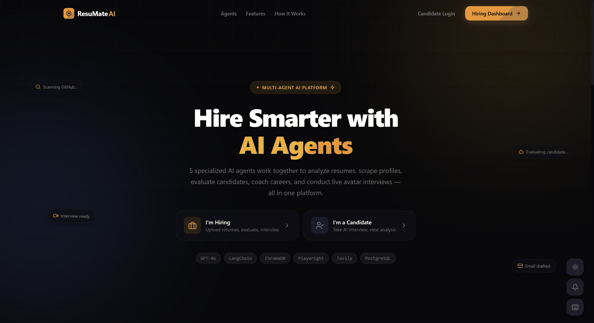
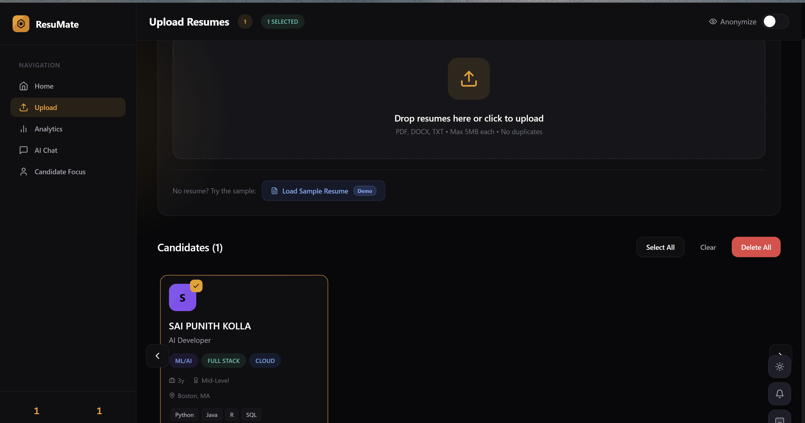
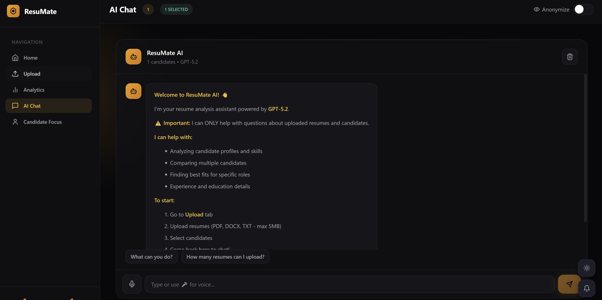
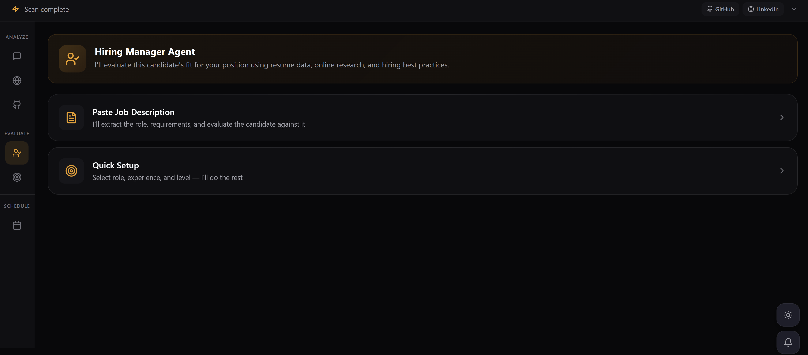
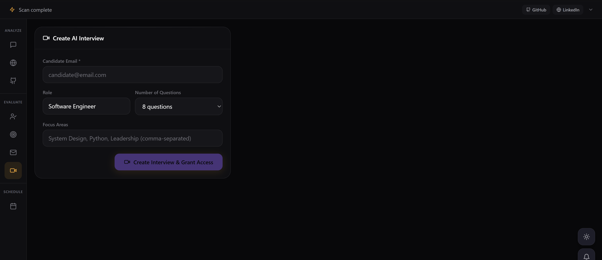
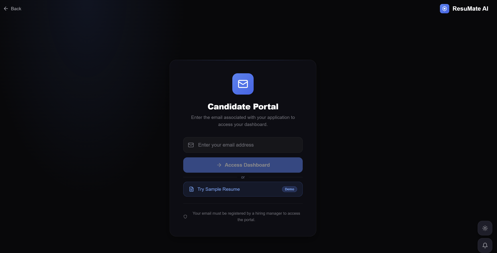
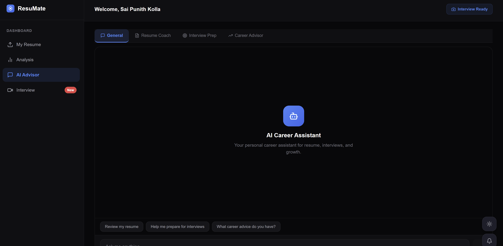
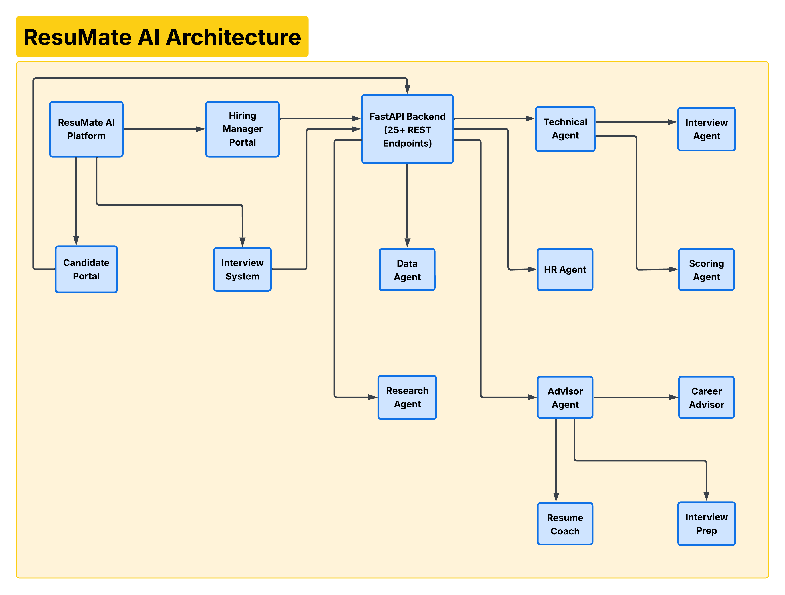
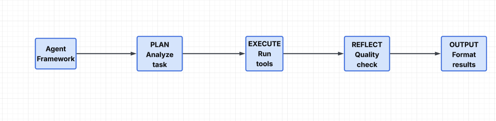

<p align="center">
  
  
  
  
  
  
  
  
</p>

# ResuMate AI

**A full-stack, multi-agent AI hiring platform**: résumé screening and evaluation, AI interviews,
career coaching for candidates, and Jarvis, a conversational copilot that runs the hiring pipeline by
voice or text.

**7 specialized AI agents** handle the work, from parsing résumés to interviewing candidates by voice
(or with a lip-synced video avatar), and Jarvis drives them all from one conversation.

---

## Demo

> **Live demo:** [resumate-ui.onrender.com](https://resumate-ui.onrender.com)
>
> *Free hosting: the server sleeps when idle and can take up to a minute to start. The app says so
> while it wakes.*

---

## Platform Preview

### Landing Page & Agent Showcase
<p align="center">
  
</p>

---

### Hiring Manager Dashboard

#### Upload & Analytics
<p align="center">
  
</p>

Upload résumés, view analytics, and rank candidates for a role.

#### AI Chat & Candidate Focus
<p align="center">
  
</p>

Multi-candidate AI chat, and a deep dive on one candidate with GitHub scanning and résumé intelligence.

#### Candidate Evaluation
<p align="center">
  
</p>

Evaluation reports with role fit, strengths and growth areas.

#### Interview Setup & Scheduling
<p align="center">
  
</p>

Create AI interviews, email the invitation (or share the sign-in link), draft emails, and schedule meetings.

---

### Candidate Portal

#### Login, Dashboard & Analytics
<p align="center">
  
</p>

Sign-in by emailed code, résumé analysis, and personal analytics.

#### AI Advisor & Live Interview
<p align="center">
  
</p>

An AI career advisor for résumé coaching and interview prep, then the interview itself.

---

## Architecture

### System Overview
<p align="center">
  
</p>

### Agent Framework
<p align="center">
  
</p>

---

## Features

### Jarvis — AI Hiring Copilot

**Jarvis** turns the hiring manager's dashboard into one voice or text conversation. It sits on top of
screening, evaluation, enrichment, interviews, reports and export, and runs them for you.

Talk to Jarvis like a colleague:

- *"Screen everyone for a Python Developer role"* → scores every uploaded résumé and names the top candidates
- *"Check his GitHub"* → repos, languages, top projects, and a technical impression
- *"Give me his drawbacks"* → an evaluation with growth areas, fit and strengths
- *"Show me her resume red flags"* → gaps, verification targets and red flags
- *"Set up interviews for the top 3"* → creates the interviews and shows each candidate's invitation draft;
  *"send it"* emails those drafts
- *"Create an interview for Maya"* → one interview, with the sign-in link to send
- *"How did his interview go?"* → the report: scores, proctoring and summary
- *"Did he exaggerate on the resume?"* → compares résumé claims with interview answers
- *"Open the PDF report"* → the downloadable assessment report
- *"What's the market rate for this role in Bangalore?"* → a web search with sources
- *"Share my Calendly link"* → your scheduling link

Jarvis keeps track of the active role, candidate and shortlist, so follow-ups like *"check his GitHub"*
or *"send it"* resolve without restating anything. Every result appears as a card you can expand.

---

### Find Candidates — Talent Mapping for the Entire Pool

Describe who you want in plain words: *"Backend engineer in Boston, strong Python, has shipped a real
product; ex-founder is a plus"*. The **Sourcer Agent** turns that into a few must-have and nice-to-have
criteria, then reads **everyone** it can reach (your uploaded résumés, GitHub, and public profiles found
by web search) and writes a judgement on every person, instead of keyword-filtering first.

- **Live talent map**: screened, judged, shortlisted, rate, time and cost so far, and a cell per person
- **Why filters would have missed them**: each shortlisted person is checked against the title +
  keyword search a recruiter would have run, with the reason it would have missed them
- **Scores you can check**: the model rates each criterion; the score is fixed arithmetic, so the same
  answers always give the same number
- **Human in the loop**: save, dismiss, and draft outreach; nothing is sent automatically
- **Public data only**, through official APIs; no LinkedIn scraping. A run reads up to a few hundred
  people, and says so when there were more

---

### Hiring Manager Portal
- **Résumé upload & RAG**: PDF/DOCX parsing, ChromaDB vector search, chat over the résumés
- **Screening**: scores every candidate against a role on fixed, inspectable weights
- **Résumé intelligence**: gaps, skills to verify, red flags
- **Scanner Agent**: links in the PDF, GitHub profiles, LinkedIn via web search
- **AI chat**: multi-candidate comparison, voice in and out, anonymized mode
- **Hiring Agent**: evaluation against a role or job description
- **Credibility analysis**: résumé claims against interview answers
- **Email composer**: AI-drafted emails (interest, interview, offer, pass, follow-up)
- **Interview creator**: role, level, questions and focus areas; emails the invitation or gives the link
- **PDF report export**

### Candidate Portal
- **Résumé upload** with a replace flow
- **AI Advisor** with three modes: Résumé Coach, Interview Prep, Career Advisor
- **The interview**: a voice conversation with an AI interviewer, or a video interview with an avatar
  where the server runs it (see below)
- **Interview report**: scores, time and proctoring

### Interview System
- **Voice interviews** (the default): OpenAI Realtime, speech to speech, in the browser
- **Avatar video interviews** (optional): LiveKit rooms with a lip-synced Simli avatar, run by a separate
  interview worker. Off unless `AVATAR_INTERVIEWS=true` and the worker is running; otherwise interviews
  run voice-only
- **Questions made for the candidate**: generated from the role and a gap analysis of the résumé
- **Proctoring** (video): face-in-view tracking, tab and window monitoring, fullscreen; 3 violations end
  the interview
- **Consent first**: before it starts, the candidate is told the interview is recorded and AI-scored
  (and, on video, that the camera checks they stay in view), and agrees

### Analytics
- **Candidates**: skills, experience, roles and levels
- **Interviews**: completion, scores, high and low performers, recent interviews

---

## Tech Stack

| Layer | Technology |
|-------|-----------|
| **Frontend** | React 18, Vite, React Router, Tailwind, Lucide icons |
| **Backend** | FastAPI, Python 3.12, SQLAlchemy (async), Alembic, Uvicorn |
| **Database** | PostgreSQL in production, SQLite locally and in tests |
| **AI** | OpenAI (chat model set by `OPENAI_MODEL`, default `gpt-4o`), embeddings, Whisper, TTS, Realtime |
| **Vector store** | ChromaDB with LangChain |
| **Interviews** | OpenAI Realtime (voice); LiveKit Cloud + Simli (avatar, optional) |
| **Search** | Tavily (web), GitHub API |
| **Email** | SendGrid |
| **Hosting** | Render (API, frontend, Postgres); the optional avatar worker on Fly.io or a paid Render worker |

---

## 7 Specialized Agents

| Agent | Role | Tools |
|-------|------|-------|
| **Jarvis** | Conversational copilot: screening, evaluation and interviews by voice or text | OpenAI, the agents below, TTS/STT |
| **Data Agent** | Résumé parsing, profile scanning, enrichment | PyPDF, GitHub API, Tavily, Playwright (if installed) |
| **HR Agent** | Evaluation, email drafting, hiring recommendations | OpenAI, salary research |
| **Technical Agent** | Interview questions, scoring, credibility analysis | OpenAI, LiveKit, Simli, Realtime |
| ↳ Interview Agent | Conducts the interview with résumé-informed questions | Realtime voice, Simli lip-sync |
| ↳ Scoring Agent | Per-question scoring; an answer it can't score is left unscored | OpenAI |
| **Research Agent** | Web search, fact-checking, citations | Tavily |
| **Sourcer Agent** | Finds people beyond your uploads and judges every one | GitHub API, Tavily, OpenAI |
| **Advisor Agent** | Career coaching for candidates (3 modes) | OpenAI, résumé context |

---

## How It Works

### Hiring Manager Flow

**On the dashboard:**
```
Upload résumés → Data Agent parses and enriches them
     ↓
Screen → candidates ranked for the role
     ↓
Résumé intelligence → gaps, verification targets, red flags
     ↓
Hiring Agent → evaluation against the job description
     ↓
Create interview → questions made from the résumé analysis
     ↓
Invite → the invitation emailed, or the sign-in link to send
     ↓
After the interview → report, credibility analysis, PDF export
```

**With Jarvis (voice or text):**
```
"Screen everyone for a Python Developer"     → ranks them, names the top candidates
"Check his GitHub" / "Give me his drawbacks" → works on the candidate in focus
"Set up interviews for the top 3"            → interviews made, invitation drafts shown
"Send it"                                    → the drafts are emailed
```

### Candidate Flow
```
Sign in with an emailed code → access given by the hiring manager
     ↓
Upload a résumé → AI analysis
     ↓
AI Advisor → Résumé Coach | Interview Prep | Career Advisor
     ↓
The interview → told what happens, agree, then voice (or avatar video) with the AI interviewer
     ↓
Report → scores, time, proctoring
```

---

## Run It Locally

You need Python 3.12 and Node 24 (CI uses both).

**Backend** (API on port 8006):
```bash
python -m venv venv
source venv/bin/activate            # Windows: venv\Scripts\activate
pip install -r backend/requirements.txt
cp backend/.env.example backend/.env   # then set SECRET_KEY and OPENAI_API_KEY
cd backend
uvicorn main:app --reload --port 8006
```
Locally the database is SQLite (`backend/resumate.db`), created on start. With `DEBUG=true` and no email
set up, sign-in, reset and deletion codes are shown in the app instead of emailed.

**Frontend** (on port 3006, proxying `/api` to the backend):
```bash
cd frontend
npm ci
npm run dev
```

## Configuration

Every setting is listed, with a comment, in [`backend/.env.example`](backend/.env.example). The ones that
matter most:

| Variable | What it does |
|----------|--------------|
| `SECRET_KEY` | Signs sign-in tokens. Required in production; the app won't start with a weak one |
| `DEBUG` | `true` only locally: relaxes the key check and shows codes when email isn't set up |
| `DATABASE_URL` | Postgres in production; SQLite by default |
| `OPENAI_API_KEY`, `OPENAI_MODEL` | The AI agents, and the model they use |
| `FRONTEND_URL` | Where invitation and password-reset links point |
| `SENDGRID_API_KEY`, `FROM_EMAIL` | Email: sign-in codes, invitations, password resets, deletion codes |
| `TAVILY_API_KEY`, `GITHUB_TOKEN` | Web search, and GitHub lookups and sourcing |
| `AVATAR_INTERVIEWS`, `LIVEKIT_*`, `SIMLI_*` | Avatar interviews, with the worker that runs them |

## Tests

```bash
cd backend && pytest -q                       # API, agents, migrations' models
cd frontend && npm run lint && npm test       # lint, then the component tests
```
CI ([`.github/workflows/ci.yml`](.github/workflows/ci.yml)) runs both, builds the frontend, and builds a
Postgres 16 database from empty with the migrations, checks it matches the models, and takes it back down
and up again.

## Deploying, and the Free Plan

[`render.yaml`](render.yaml) deploys the API, the frontend and Postgres on Render's free plan;
[`backend/DEPLOY.md`](backend/DEPLOY.md) has the details. What the free plan means:

- **The server sleeps** after about 15 idle minutes and takes up to a minute to start again. The app tells
  people while it wakes.
- **The free database is deleted 30 days after it is created.** Back it up about every three weeks with
  `backend/scripts/backup_db.py`, and restore into a new one when it expires (steps in DEPLOY.md).
- **Avatar interviews are off**: they need a worker process, which the free plan doesn't run. Interviews
  run voice-only until you run the worker and set `AVATAR_INTERVIEWS=true`.
- **Email needs SendGrid** with a verified sender (`FROM_EMAIL`). Without it, invitations can't be
  emailed: the app gives the manager the sign-in link to send instead.

## Data and Privacy

- **Consent**: managers agree to the Terms and Privacy Policy at sign-up; candidates agree before an
  interview starts. Both are recorded.
- **Deletion**: a candidate can delete their data from the portal. Anyone else, including people a
  manager uploaded or a search found, can ask at `/privacy/delete`: an emailed code confirms it, and the
  page never reveals whether anything was held. Managers can delete their account and all its data.
- **Separation**: each manager sees only their own candidates and interviews.
- **Backups** hold personal data: they are git-ignored, and never CI artifacts (the repository is public).

## Status

The Terms of Service and Privacy Policy pages hold placeholder text, marked as such, until reviewed legal
text replaces it.

---

## License

All Rights Reserved. See [LICENSE](LICENSE) for details.

---

<p align="center">
  Built by <strong>Sai Punith Kolla</strong>
</p>
